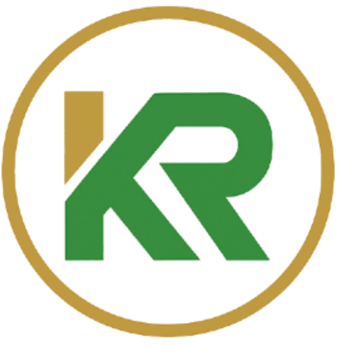

# KAMRAY Coaching & Consulting



## 📋 Description

Site web professionnel pour **KAMRAY Coaching & Consulting**, dirigé par **Dr. Abdelmonem Kaaniche**, expert tuniso-africain en leadership et coaching stratégique. Le site présente les services de transformation personnelle et professionnelle avec une expertise particulière sur le continent africain.

## 🚀 Technologies Utilisées

- **Framework**: Next.js 15.4.5 avec React 19.1.0
- **Langage**: TypeScript 5
- **Styling**: TailwindCSS v4 avec système de design personnalisé
- **UI Components**: Shadcn/UI avec style "new-york"
- **Icons**: Lucide React
- **Cartes interactives**: Leaflet avec React-Leaflet
- **Animations**: tw-animate-css
- **Outils de développement**: ESLint, Turbopack

## 🎨 Design System

### Palette de Couleurs KAMRAY
- **Vert principal**: `oklch(0.45 0.15 140)` - Couleur signature KAMRAY
- **Or/Doré**: `oklch(0.65 0.12 85)` - Couleur secondaire élégante
- **Rouge accent**: `oklch(0.55 0.22 25)` - Pour les call-to-actions
- **Système neutre**: Basé sur Shadcn avec support dark/light mode

### Typographie
- **Police principale**: Inter (sans-serif)
- **Police titres**: Playfair Display (serif)
- **Hiérarchie**: Système cohérent avec classes Tailwind

## 📁 Structure du Projet

```
src/
├── app/
│   ├── globals.css          # Styles globaux et variables CSS
│   ├── layout.tsx           # Layout principal avec Header/Footer
│   └── page.tsx             # Page d'accueil avec toutes les sections
├── components/
│   ├── Header.tsx           # Navigation responsive avec menu mobile
│   ├── Footer.tsx           # Pied de page avec informations contact
│   ├── MapComponent.tsx     # Carte interactive Leaflet
│   ├── SmoothScroll.tsx     # Navigation fluide entre sections
│   └── sections/            # Sections modulaires de la page
│       ├── HeroSection.tsx      # Section héro avec portrait
│       ├── AboutSection.tsx     # Présentation Dr. Abdelmonem
│       ├── ServicesSection.tsx  # Services de coaching
│       ├── ExpertiseSection.tsx # Domaines d'expertise Afrique
│       ├── NewsSection.tsx      # Actualités et ressources
│       ├── TestimonialsSection.tsx # Témoignages clients
│       ├── ContactSection.tsx   # Formulaire et coordonnées
│       └── CTASection.tsx       # Call-to-action final
└── lib/
    └── utils.ts             # Utilitaires (cn, clsx, tailwind-merge)
```

## 🌟 Fonctionnalités

### ✅ Implémentées
- **Navigation responsive** avec menu hamburger mobile
- **Design moderne** avec palette de couleurs KAMRAY
- **Sections complètes**:
  - Hero avec portrait professionnel
  - Présentation détaillée du Dr. Abdelmonem
  - Services de coaching et consulting
  - Expertise secteurs africains
  - Section actualités et ressources
  - Témoignages clients
  - Contact avec carte interactive
  - Call-to-action engageant
- **Optimisations**:
  - Images optimisées avec Next.js Image
  - Support des images Unsplash
  - SEO-friendly avec métadonnées
  - Accessibilité (aria-labels, navigation clavier)

### 🚧 En Développement
- Pages détaillées (À propos, Services individuels)
- Système de blog/actualités
- Formulaires de contact fonctionnels
- Animations et micro-interactions
- Optimisations performance

## 🛠️ Installation et Développement

### Prérequis
- Node.js 18+ 
- npm ou yarn

### Installation
```bash
# Cloner le repository
git clone [url-du-repo]
cd kamray

# Installer les dépendances
npm install

# Lancer le serveur de développement
npm run dev
```

### Scripts Disponibles
```bash
npm run dev      # Serveur de développement avec Turbopack
npm run build    # Build de production
npm run start    # Serveur de production
npm run lint     # Vérification ESLint
```

## 🌍 Expertise Africaine

Le site met en avant l'expertise unique du Dr. Abdelmonem Kaaniche sur le continent africain :
- **Formation d'excellence**: INSA Lyon & École des Mines Paris
- **Leadership industriel**: Expérience terrain en Afrique
- **Coaching stratégique**: Transformation personnelle et professionnelle
- **Secteurs d'expertise**: Énergie, industrie, développement durable

## 📱 Responsive Design

Le site est entièrement responsive avec :
- **Mobile-first** approach
- **Breakpoints Tailwind**: sm, md, lg, xl, 2xl
- **Navigation adaptative**: Menu hamburger sur mobile
- **Images optimisées**: Différentes tailles selon l'écran
- **Typographie fluide**: Tailles adaptatives

## 🎯 Objectifs Business

1. **Présentation professionnelle** du Dr. Abdelmonem et de KAMRAY
2. **Génération de leads** via formulaires de contact
3. **Positionnement expert** sur le marché africain
4. **Ressources et contenus** pour établir l'autorité
5. **Prise de rendez-vous** facilitée

## 📞 Contact

**KAMRAY Coaching & Consulting**  
Dr. Abdelmonem Kaaniche  
Expert en Leadership et Coaching Stratégique

---

*Développé avec ❤️ en Next.js et TailwindCSS*